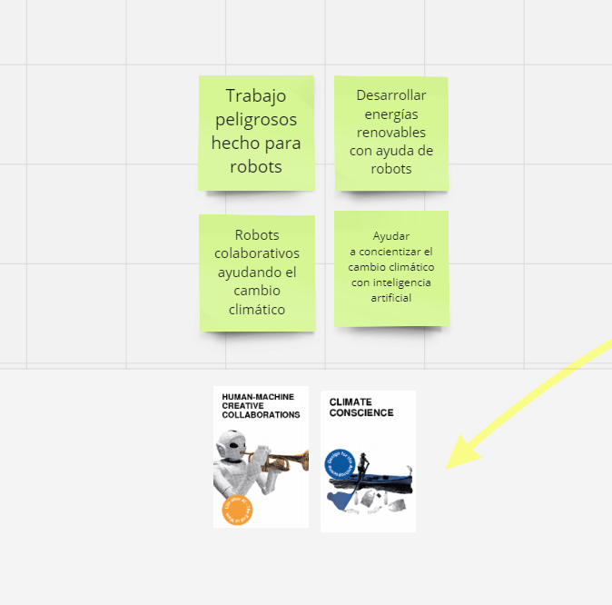

---
hide:
    - toc
---

# MD01

### Herramienta Atlas of Weak Signals:

En este apartado de diseño md01, se utilizará Atlas of Weak Signals, una herramienta que revela áreas de oportunidad para diseñar futuros emergentes. Esta metodología proporciona una estructura visible para estudiantes, diseñadores y profesionales de diversos campos, permitiéndoles identificar oportunidades de intervención. Las señales débiles son indicadores tempranos de cambio con potencial para desencadenar eventos importantes en el futuro. Al recopilar y organizar estas señales, se crea una taxonomía de palabras clave que sirve como punto de partida para analizar sistemas actuales y construir posibles escenarios futuros. 

Weak-signals:

http://www.fuel4design.org/index.php/atlas-of-weak-signals/

### Herramiento MIRO 

Se utilizará la herramienta Miro para trabajar con el Atlas of Weak Signals. Miro proporciona una plataforma colaborativa que permite a los miembros del grupo recopilar, organizar y analizar de manera conjunta. Con Miro se pueden crear tableros virtuales donde pueden agregar y categorizar las señales, facilitando la colaboración en tiempo real y la visualización de patrones emergentes. Esta herramienta también permite la integración de notas y comentarios para enriquecer el proceso de análisis y diseño.

### Primer Paso. Seleccionar Señales Débiles

Escoger 2 de las siguientes Señales Débiles del mazo. Simplemente levanta o elimina la cubierta. Colócalas en los Espacio de Diseño dispuestos para las señales débiles. Observar las tarjetas seleccionadas y reflexiona sobre los temas, ejemplos o palabras clave que te sugieren.

### Segundo Paso. Explorar Áreas de Oportunidad

Empezar a ver las posibilidades que empiezan a aparecer, pero miremos algunas Áreas de Oportunidad que estamos usando en Fab Lab Barcelona para prototipar futuros emergentes. Elige dos cartas. Observa las nuevas tarjetas seleccionadas y reflexiona sobre las posibles interconexiones que podrían surgir entre ellas y las señales débiles anteriores.

### Tercer Paso. Selecciona dos Conceptos Detonantes

Escoger dos de los Conceptos Detonantes dispuestos abajo. Estas serán palabras clave o campos de investigación con los que estamos trabajando y prototipando en esta sesión. Colócalas en el Espacio de Diseño, estas tarjetas te pueden ayudar a encontrar oportunidades o relaciones que no habías pensado aún. Observar los Conceptos Detonantes seleccionados y reflexionar sobre los escenarios en los que podrían cohabitar con las señales débiles y áreas de oportunidad previamente identificadas.

### Cuarto Paso. Explorar la metodología de mapeo multi-escalar

Este enfoque proporciona una estructura para explorar la complejidad y encontrar conexiones significativas entre diferentes escalas y sistemas, lo que puede ayudar a generar nuevas ideas y soluciones innovadoras frente a las crisis actuales

### Quinto paso. De las áreas de interés a los presentes alternativos

Ahora vamos un paso más allá e intentemos describir los presentes alternativos que van surgiendo de nuestro espacio de diseño, experimentos y acciones. Los escribimos en presente y en primera persona ofreciendo como apoyo una serie de ejemplos de todo lo que hemos estado haciendo.

### Resultado final

El resultado final del diseño de la idea pensada es un proyecto integral de implementación de sistemas descentralizados de energía y tecnologías de gestión inteligente en entornos urbanos, con el objetivo de reducir la dependencia de la red eléctrica centralizada y promover el uso de fuentes de energía renovables.
Para acceder al Miro con las cartas de Atlas utilizadas en el diseño de esta idea,

https://miro.com/app/board/uXjVKQ8Rt_E=/