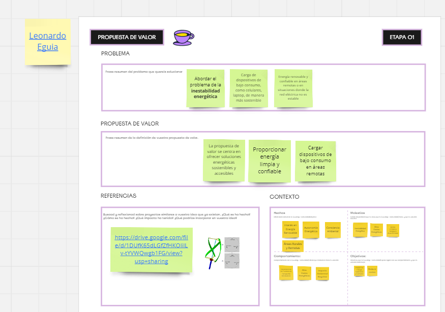
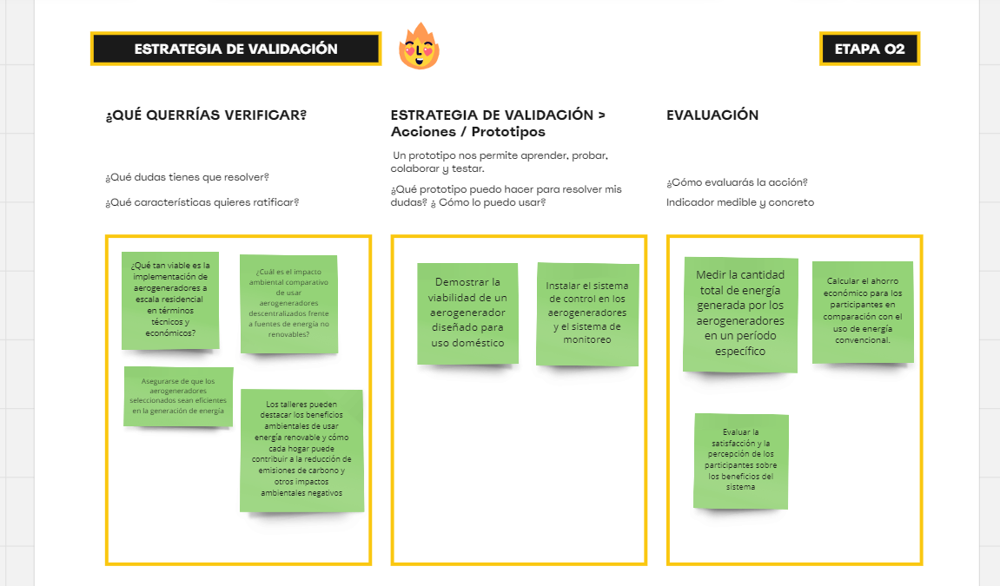

---
hide:
    - toc
---

# MD02

### Herramienta MIRO:

En este apartado de diseño md02, se utilizará una herramienta Miro para seguir un proceso estructurado de selección de intervenciones. Este proceso incluye definir objetivos claros, identificar necesidades específicas de la comunidad, evaluar la viabilidad técnica y económica de las intervenciones propuestas, y considerar su impacto en la sostenibilidad y calidad de vida. Además Miro proporciona una plataforma colaborativa que permite a los miembros del grupo recopilar, organizar y analizar de manera conjunta. Con Miro se pueden crear tableros virtuales donde pueden agregar y categorizar las señales, facilitando la colaboración en tiempo real y la visualización de patrones emergentes. Esta herramienta también permite la integración de notas y comentarios para enriquecer el proceso de análisis y diseño.
Weak-signals:

URL: https://miro.com/es/

### Primer Paso. Problema, Propuesta de valor, referencia y contexto

Este primer paso sienta las bases para el desarrollo de intervenciones específicas y la formulación de objetivos claros que guiarán todo el proyecto. Es esencial entender profundamente el problema y la propuesta de valor para asegurar que las acciones futuras estén alineadas con la solución deseada y puedan generar un impacto positivo significativo

### Segundo Paso. Estrategias de validación

Una vez definido el problema y la propuesta de valor en el primer paso, el siguiente paso es desarrollar una estrategia de validación. Esta estrategia consiste en planificar cómo se verificará y demostrará la efectividad y viabilidad del proyecto de descentralización de energía con aerogeneradores.

### Tercer Paso. Criterios de selección de las intervenciones

Después de definir el problema, establecer la propuesta de valor y desarrollar una estrategia de validación en los pasos anteriores, el tercer paso es establecer criterios claros para seleccionar las intervenciones específicas que se implementarán.

![](../images/MD02/image_md02_3.png

### Reflexión 

 Estos pasos proporcionan un marco robusto para abordar los desafíos complejos asociados con el proyecto de la energía eléctrica mediante aerogeneradores. Permitiendo no solo enfrentar problemas técnicos y económicos, sino también asegurar que la solución propuesta sea aceptada y beneficien a la población de manera significativa. No solo se fortalece la base teórica y práctica del proyecto, sino que también se asegura que contribuya positivamente a la sostenibilidad ambiental, económica y social.