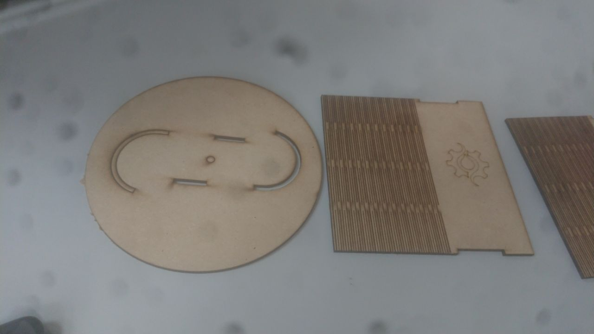
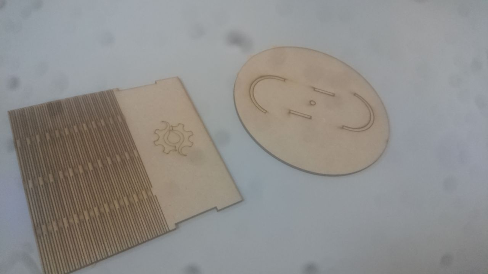
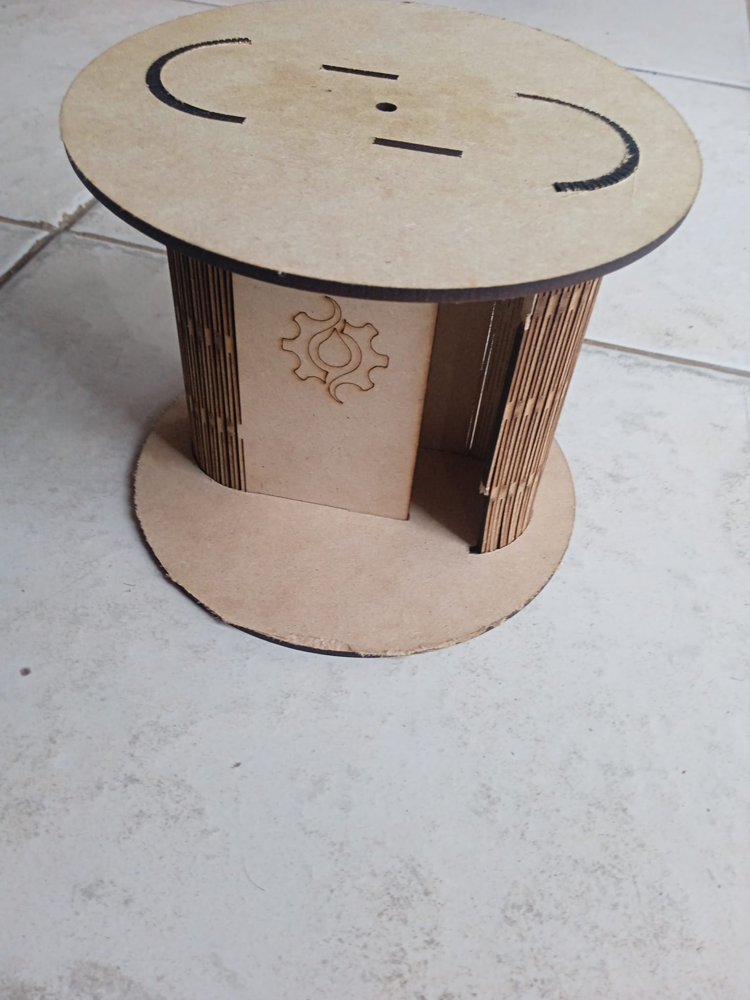

---
hide:
    - toc
---

# FP01

El módulo FP01, semana de fabricación presencial, está diseñado para aplicar y profundizar en los conocimientos adquiridos en el módulo MT03, llevando los diseños desde el software hasta la realidad física. En este módulo, se utilizarán la generación de G-code desarrolladas previamente para realizar el corte láser de piezas en el laboratorio de UTEC en Fray Bentos.

### Resultado del Proceso de Corte Láser

Luego de cargar el g-code a la cortadora laser se obtuvieron las piezas como se ven en la siguiente imágen.

### Ensamblado Final y Ajustes Manuales de las Piezas

Luego de ensamblar las piezas cortadas con láser, se constató que las holguras eran adecuadas, pero no se consideró el kerf bend, lo que resultó en una longitud mayor. Por ello, se realizaron cortes manuales adicionales. A continuación, se presenta la imagen del resultado final del ensamblado.

