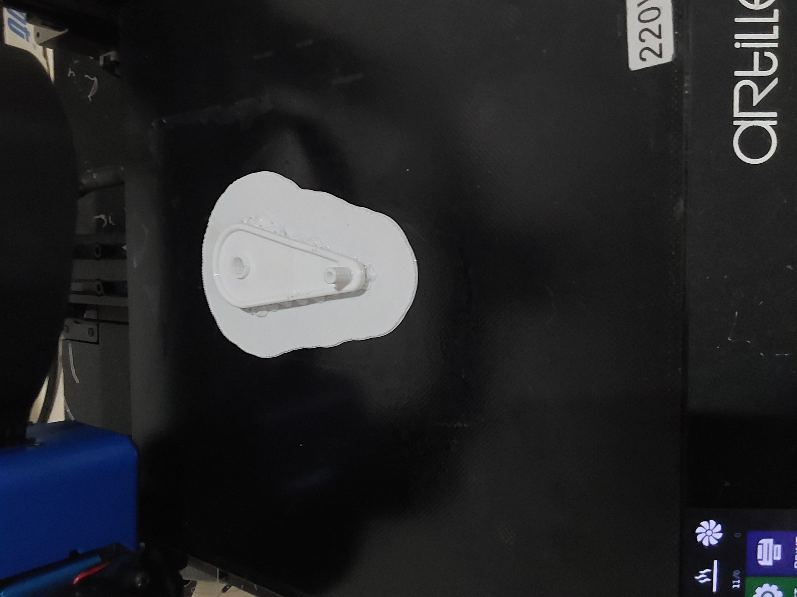

---
hide:
    - toc
---

# FP02

El módulo FP02, semana de fabricación presencial, está diseñado para aplicar y profundizar en los conocimientos adquiridos en el módulo MT05, llevando los diseños desde el software hasta la realidad física. En este módulo, se utilizarán la generación de G-code desarrolladas previamente para impresión 3d FDM de piezas en el laboratorio de UTEC en Fray Bentos. En este caso fue realizado con una impresora propia utilizando los mismos parametoros de configuración que MT05 con el software IdeaMaker.

### Proceso de software laminador

El proceso comenzó con la carga del modelo .stl de la pieza en el software Ultimaker Cura. A continuación, se configuraron los mismos parámetros utilizados en el módulo MT05 dentro de IdeaMaker. Posteriormente, se realizó el proceso de laminado, donde cada capa del modelo fue inspeccionada para asegurar la ausencia de errores. Una vez verificado, el archivo .gcode se exportó a una unidad de almacenamiento extraíble para su posterior impresión.

### Resultado de la Impresión 3D

Como se puede observar en las siguientes figuras, la pieza impresa tiene un buen acabado. Los soportes fueron fáciles de remover, permitiendo que la pieza se mantuviera íntegra. Sin embargo, en la zona de contacto entre la pieza y los soportes quedaron algunos detalles que afectan ligeramente la superficie. Durante una discusión en clase, se sugirió que la impresión, se podría orientar con el engranaje hacia arriba. Esta alternativa implica un mayor uso de soportes, pero podría mejorar la definición del engranaje, mostrando así una de las ventajas y desventajas de diferentes orientaciones en la impresión 3D.

### Desafíos durante la Impresión 3D

Un desafío significativo fue la dificultad para encontrar y configurar el tipo de soporte de árbol en IdeaMaker, el cual es particularmente útil para reducir el material y el tiempo de impresión al ofrecer un soporte más eficiente. Pero para la impresión se utilizó este tipo de soporte