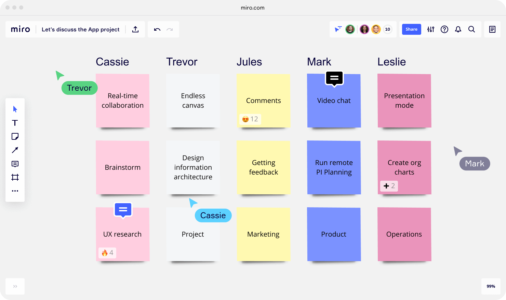
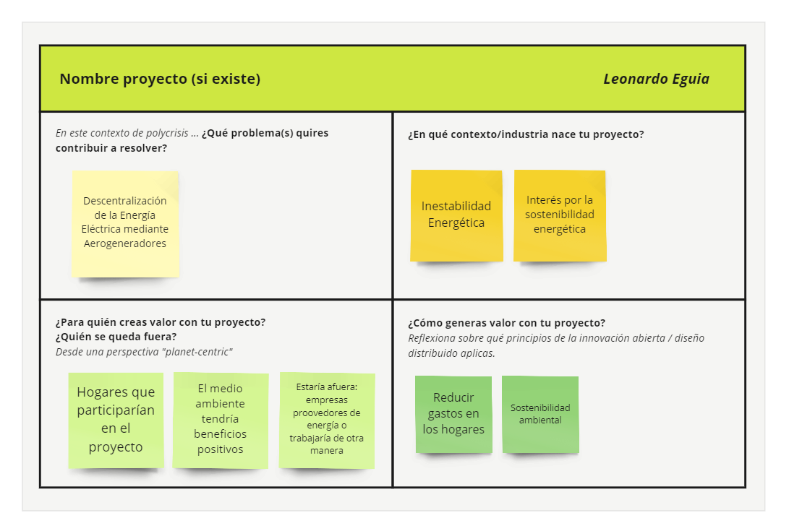
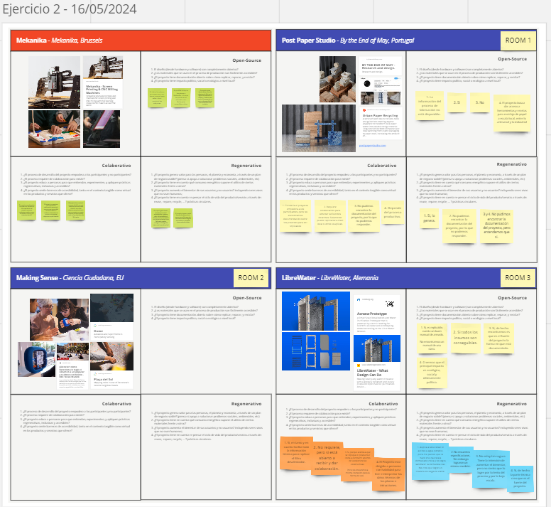

---
hide:
    - toc
---

# MI01

El módulo MI01, titulado "Diseño Distribuido e Innovación Abierta", está diseñado para explorar y aplicar conceptos avanzados de creación colaborativa y sostenible en el diseño. Este módulo se centra en fomentar una mentalidad abierta, promoviendo prácticas colaborativas y principios de diseño regenerativo dentro de un marco de visión ecosistémica. Teniendo en cuenta los siguientez enfoques; mentalidad abierta, prácticas Colaborativas y principios de diseño regenerativo.

### Herramiento MIRO 

Para facilitar la colaboración y el intercambio de ideas, se utilizará la herramienta Miro, una plataforma digital que permite la co-creación en tiempo real.

URL: https://miro.com/es/

### Idea para el proyecto final

Se tuvo en cuenta 4 preguntas para lograr expandirse en la idea del proyecto. 
¿Qué problema(s) quieres contribuir a resolver?
¿En qué contexto/industria nace tu proyecto?
¿Para quién creas valor con tu proyecto? 
¿Quién se queda fuera?
¿Cómo generas valor a tu próyecto?

El proyecto se centra en abordar la descentralización de la energía eléctrica mediante aerogeneradores domésticos. Este enfoque busca proporcionar soluciones innovadoras para la generación de energía local, ayudando a mitigar los problemas de inestabilidad en el suministro eléctrico.

URL: https://miro.com/app/board/uXjVKMo0rPU=/

### Actividad en Grupo y Reflexión sobre proyectos

En esta actividad, se realizaron una reflexión colaborativa sobre varios proyectos. El análisis se centró en evaluar cómo estos proyectos aplica los principios de la innovación abierta, diseño colaborativo y diseño regenerativo.

### Conclusín

Las actividades del módulo MI01 han demostrado que la combinación de innovación abierta, diseño colaborativo y principios regenerativos puede producir soluciones robustas y sostenibles para problemas complejos. La participación activa de la comunidad y el uso de herramientas digitales son elementos esenciales para el éxito de estos proyectos. En conjunto, estas prácticas promueven un entorno de aprendizaje continuo y adaptativo, necesario para enfrentar los desafíos contemporáneos de manera efectiva y sostenible.