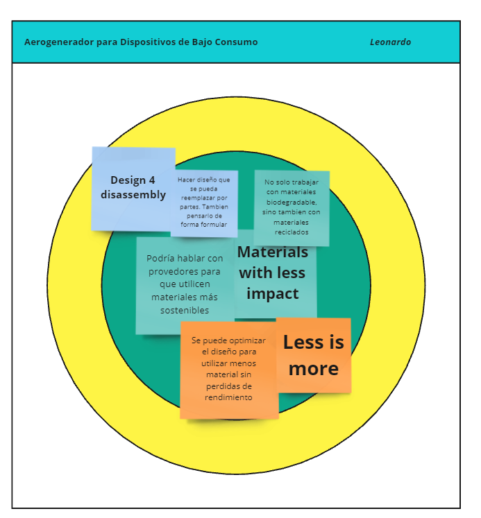

---
hide:
    - toc
---

# MI02

El módulo MI02, "Desarrolo sostenible y Economía Circular", trató sobre la importancia de la sostenibilidad en el contexto urbano y la necesidad de crear ciclos de vida circulares. Se destacaron desafíos de reciclaje y se enfatizaron que la responsabilidad de los residuos debería recaer en las empresas productoras, no en los consumidores. Además se mencionó proyectos innovadores como botellas biodegradables.

### Herramiento MIRO 

Para facilitar la colaboración y el intercambio de ideas, se utilizará la herramienta Miro, una plataforma digital que permite la co-creación en tiempo real.

URL: https://miro.com/es/

### Primera actividad. 

La primera actividad se centró en ayudarnos a identificar qué tan sostenibles somos dependiendo de nuestras acciones diarias y hábitos de consumo. Esta autovaloración nos permitió reflexionar sobre nuestras prácticas en relación con el cuidado del medio ambiente y la sostenibilidad. Cada uno se auto asignaba una categoría que representaba su nivel de conciencia y compromiso con la sostenibilidad, desde un activista plenamente comprometido hasta alguien que no toma en cuenta estos aspectos.

En mi caso me autoevalué en las categorías D y E, donde me encuentro en un nivel donde ya he comenzado a hacer algunos cambios hacia una vida más sostenible, como reducir el consumo de carne y lácteos, y explorar formas de ahorrar energía en casa

URL: https://miro.com/app/board/uXjVKjpb7U4=/

### Segunda actividad

Esta actividad se centró en una reflexión personal sobre el proyecto, utilizando preguntas clave relacionadas con la posición actual, influencias, y preocupaciones. El objetivo es analizar tanto acciones como percepciones en el contexto de trabajo, teniendo en cuenta aspectos que permitan una autoevaluación en profundidad, orientada a detectar puntos de mejora, definir objetivos claros y alinear acciones con las metas del proyecto.

### Tercera actividad

Esta actividad busca evaluar y mejorar la sostenibilidad del proyecto mediante un enfoque basado en el Diseño Circular. Se divide en tres pasos principales:

Reflexión sobre el color del proyecto:

En mi caso siento que el impacto de mi proyecto es moderado de color amarillo. Por ejemplo utilizaré materiales biodegradables poero no materiales reciclados. Deseeo para el futuro poder usar materiales reciclados, alcanzando una sostenibilidad y podría representarlo con color verde.

Luego de analizar los principios del Diseño Circular, seleccioné tres acciones prácticas que se centran en los hotspots de mi proyecto, con el objetivo de maximizar el impacto en su sostenibilidad. Estas son:

Design 4 Disassembly: Esta acción consiste en diseñar el producto de manera que sus componentes puedan ser fácilmente desensamblados, permitiendo la reparación, actualización o el reemplazo de partes específicas en lugar de desechar el producto completo.

Materials with Less Impact: No se trata solo de utilizar materiales biodegradables, sino también de integrar materiales reciclados en el proceso de producción. Esta acción busca reducir el impacto ambiental al optar por materias primas que generen menos residuos y que provengan de fuentes más sostenibles.

Less is More (Menos es Más): Se puede optimizar el diseño del producto para utilizar menos recursos sin comprometer su rendimiento. 

### Reflexión

Las actividades del módulo MI02 me han permitido reflexionar sobre el impacto que mi proyecto puede tener en términos de sostenibilidad y cómo puedo integrar principios del Diseño Circular para maximizar ese impacto. Estas actividades me han impulsado a pensar de manera más estratégica y sistémica, considerando cómo cada decisión puede influir en el resultado final, tanto desde una perspectiva técnica como ecológica.