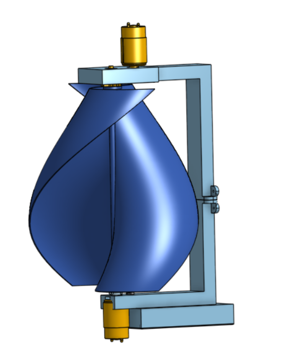
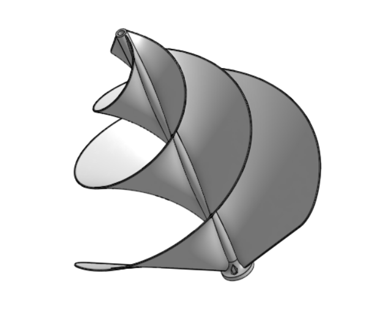

---
hide:
    - toc
---

# Diseño y Desarrollo

En esta sección se presentarán los modelos 2D y 3D elaborados para el proyecto, así como los programas y herramientas utilizadas durante su creación. Aquí se describirán los procesos de diseño, las decisiones tomada, proporcionando una visión completa del desarrollo técnico involucrado.

## Diseño del Aerogenerador en Onshape

[Diseño Onshape](https://cad.onshape.com/documents/d00981b68e603b529d765439/w/35fc90b824740c0567aa3f36/e/42272ec65a16435550e6e8af?renderMode=0&uiState=6763c3d0ea1bb7208a384773)

[Diseño en Drive](https://drive.google.com/drive/folders/1p8gDfAZooveBaQ2LT-oEK_BtA41oC98Y?usp=sharing)

## Diseño de otros generadores de prueba en Onshape

[Diseño Onshape](https://cad.onshape.com/documents/3cde3bc212bc4d7eeb2f07b2/w/559f4a579d8bfbdd402c773a/e/5f17ad22840f9abc1e5aaca7?renderMode=0&uiState=6763c57c8d6b2f7c4be76c38)

## Programacióne en Arduino ESP8266

[Programación Arduino](https://drive.google.com/drive/folders/1UrwENxn14EPY789HZ3EZp06HSgU1InXU?usp=sharing)

## Pagina WEB

[Página web](https://drive.google.com/drive/folders/1nRTnmBAPsnKtNE7hwtzXoYWXcFnMxp6D?usp=sharing)
