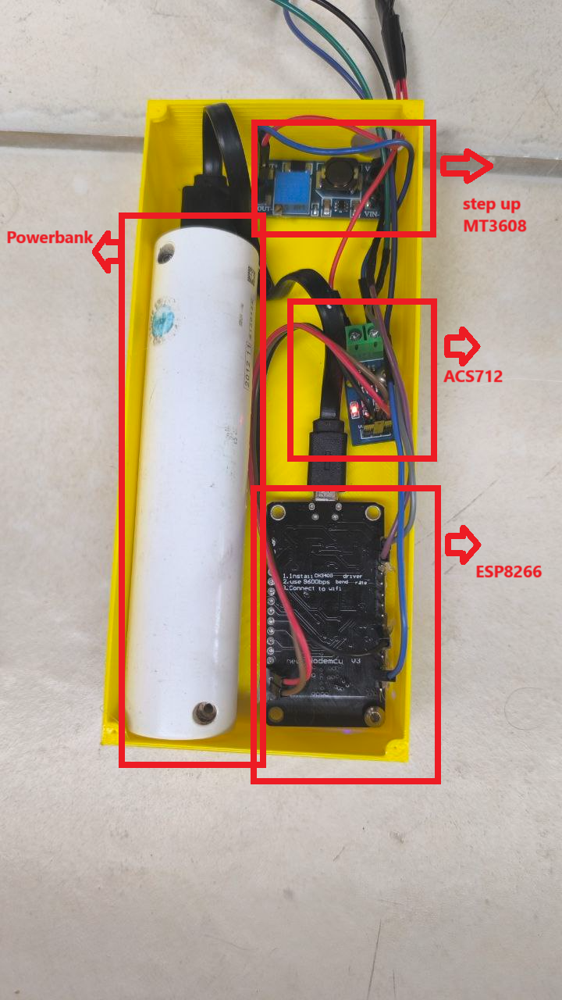

---
hide:
    - toc
---

# Aerogenerador para el Soporte de Dispositivos de Bajo Consumo en Remotas

## Planteamiento del Problema

El problema surge de la experiencia en proyectos desarrollados en UTEC, donde frecuentemente se trasladan dispositivos y sistemas tecnológicos a áreas remotas para aplicaciones en campo, como estaciones meteorológicas, robots autónomos y sensores para el monitoreo ambiental o agrícola. En estos entornos, la autonomía de los dispositivos depende principalmente de baterías, que se agotan con rapidez y requieren recargas constantes o sustitución, lo cual es complejo y costoso en zonas de difícil acceso.

Este desafío tiene la necesidad de una fuente de energía sostenible, confiable y descentralizada que pueda soportar dispositivos de bajo consumo en estas áreas. Una solución como un aerogenerador diseñado para estos dispositivos podría proporcionar una autonomía prolongada y reducir la dependencia de baterías o la necesidad de conexión a la red eléctrica, facilitando la operación continua de proyectos tecnológicos en zonas rurales y remotas.

La problemática surge de la experiencia en diversos proyectos desarrollados en UTEC, los cuales suelen frecuentemente trasladar dispositivos y sistemas tecnológicos a áreas remotas para aplicaciones de campo. Algunos ejemplos son estaciones meteorológicas, robots autónomos, sensores para monitoreo ambiental o agrícola, etc. En estos entornos, la autonomía de los dispositivos está limitada por baterías, que se agotan con rapidez y deben ser recargadas o sustituidas, lo que en general no puede hacerse de manera eficiente.

Este desafío es caracterizado por la carencia de una fuente de energía sostenible, confiable y descentralizada que pueda soportar dispositivos de bajo consumo en estas áreas, en otras palabras, una solución como un aerogenerador diseñado para estos dispositivos podría proporcionar una autonomía prolongada y reducir la dependencia de baterías o la necesidad de conexión a la red eléctrica, facilitando la operación continua de proyectos tecnológicos en zonas rurales y remotas.

## Etapa de prototipado

Los primeros pasos del prototipo están enfocados en adaptar un diseño de aerogenerador que sea eficiente a bajas velocidades de viento, adecuándose a las condiciones típicas de Uruguay. En esta etapa inicial, se están investigando y seleccionando modelos de aerogeneradores de eje horizontal y vertical, evaluando cuál de ellos podría generar suficiente energía bajo velocidades de viento moderadas.

## Pruebas con diseño de aerogenerador Liam F1

## Pruebas diseño aerogenerador Darrieus

[video prueba de diseño Darrieus](../images/proyecto/video_00.mp4)

## Pruebas con diseño Savonius

## Pruebas usando tren de engranajes 1:3

 
## Interfaz web para monitoreo de RPM y Potencia

## Pruebas usando engranajes de correa 1:2.5

## Impresión de soporte para sostener de ambos lados las aspas

[video prueba de diseño Darrieus usando ventilador](../images/proyecto/video_01.mp4)

## Pruebas de rendimiento

[video prueba aerogeneradro Darrieus ](../images/proyecto/video_02.mp4)

## Caja electrónica

Componentes utilizados:

- step up MT3608 

- Sensor de corriente ACS712

- Microcontrolador ESP8266

- Powerbank de 2000 mAh

## Motores Generadores

Componentes utilizados:

- 2 motores DC 12 V reciclado de impresora

- Sensor Efecto Hall A3144

- 2 Imán de neodimio redondo 5x3mm

## Prototipo Final

Interfaz web donde se suben los dates a traves de la esp8266, en esta web se pueden ver los datos de las revoluciones de las aspas del aerogenerador y la corriente que este genera.

## Prototipo Final

## Pruebas Finales

[video prueba final encendiendo 5 LED](../images/proyecto/video_03.mp4)

[video prueba final encendiendo 5 LED en Oscuridad](../images/proyecto/video_04.mp4)

