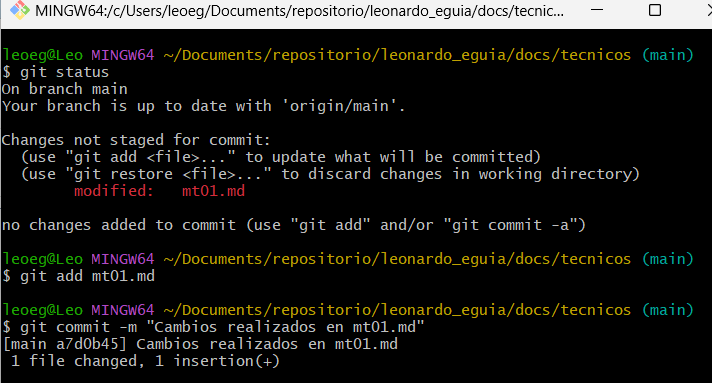
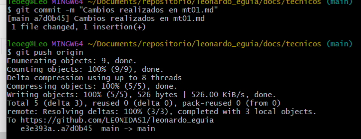

---
hide:
    - toc
---

# MT01

En el módulo MT01, se ha encomendado la tarea de comprender y dominar el proceso de creación de un repositorio en GitHub. GitHub, una plataforma de desarrollo colaborativo basada en la nube, se ha convertido en una herramienta indispensable para el el control de versiones y la gestión de proyectos en el ámbito de la programación y más allá.

### Crear un fork del template de EFDI:

En el repositorio del template se hace un fork del siguiente enlace https://github.com/fablabbcn/efdi-template. 

### Utilización github.dev para realizar modificaciones:

El editor basado en web de github.dev se puede utilizar para editar archivos y confirmar los cambios de github. Además proporciona muchas de las ventajas de Visual Studio Code, como las búsquedas, el resaltado de la sintaxis y la vista del control de código fuente. También puedes utilizar la sincronización de la configuración para compartir tus propios valores de configuración de VS Code con el editor. La forma más fácil de acceder a él es desde el propio repositorio de GIthub, apretar la tecla ".". Viendo el siguiente tutorial se puede ver como utilizarlo, muy semejante a Visual Studio Code. 
[Tutorial github.dev](https://www.youtube.com/watch?v=d7jHUh1PGwU)
<iframe width="560" height="315" src="https://www.youtube.com/embed/d7jHUh1PGwU" frameborder="0" allowfullscreen></iframe>

### GitHub Pages 

Hacemos uso del servicio de alojamiento de sitio estático directamente desde un repositorio en GitHub. Luego de hacer el primer push, configuramos desde github desde Settings

### Modificaciones en las diferentes vistas

Se modificaron las diferentes vistas en las páginas para personalizarlas y agregar mis datos. Además agregar el paso a paso para hacer la actividad mt01.

### Realizar Commit en Github.dev

Luego de realizar las modificaciones en Github.dev, se debe ir a la pestaña Control de Código Fuente, ver las diferentes modificaciones que se hicieron en los diferentes archivos. Al final se debe agregar un comentario, se debe confirmar y realizar el commit. En la siguiente imagen se puede ver en donde se encuentran los diferentes botones para poder realizar estos pasos. 

### Paso a Paso realizado con GIT

Abrir la terminal o línea de comandos. 
Navegar hasta la carpeta donde se desea clonar el repositorio utilizando el comando "cd". 
Se inicializa el repositorio con el comando "git init" 
Luego se clona el repositorio con el comando "git clone "url" "

Esto creará una copia local del repositorio en la carpeta actual.
Una vez clonado, entrar en el directorio del repositorio. Abrir el archivo que se desea modificar (mt01.md) en un editor de texto o IDE preferido y realizar las modificaciones necesarias. 
Antes de hacer un commit, se puede verificar los cambios realizados utilizando "git status".  
Añadir el archivo modificado al área de preparación para el commit con "git add mt01.md"

Realizar commit con un mensaje descriptivo sobre los cambios realizados "git commit -m "Cambios realizados en mt01.md" " 
Enviar los cambios al repositorio, utiliza el comando "git push origin"

### Conclusión

Entender la herramienta como GitHub que puede integrarse para optimizar la gestión de proyectos. La creación de un repositorio, la edición y confirmación de cambios, la configuración de GitHub Pages para la publicación de contenido estático, y la personalización de documentación son pasos esenciales en el desarrollo de proyectos.