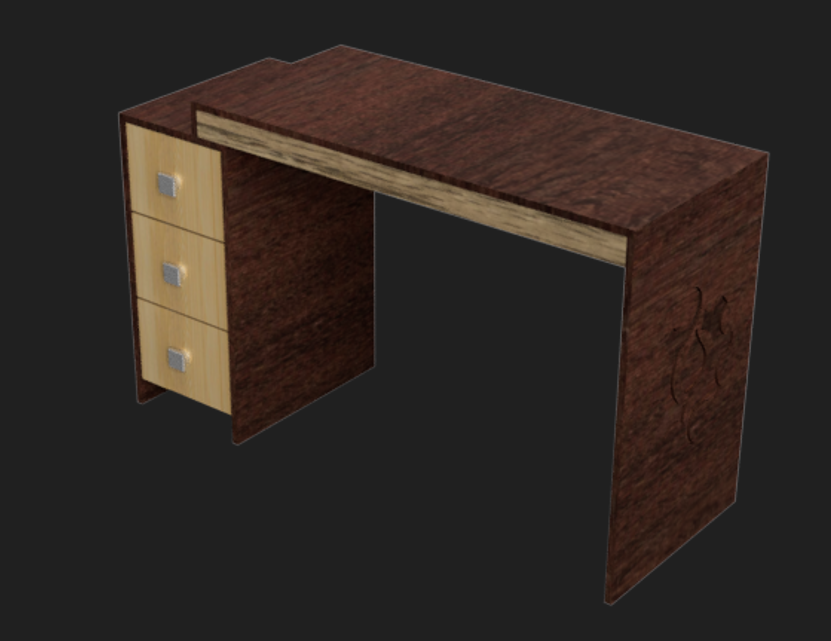

---
hide:
    - toc
---

# MT02

La actividad MTO2 consistirá en el diseño de un objeto utilitario compuesto por al menos dos piezas y que incluya un logo en relieve. Los participantes crearán una lámina de presentación simple que contenga un título, una imagen del producto y una breve descripción del mismo. El objetivo es fomentar la creatividad en el diseño de objetos funcionales y estéticamente atractivos.

### INKSCAPE

Inkscape es un editor de gráficos vectoriales libre y de código abierto. Inkscape puede crear y editar diagramas, líneas, gráficos, logotipos, e ilustraciones complejas. El formato principal que utiliza el programa es Scalable Vector Graphics

La URL para acceder: https://inkscape.org/es/

Este software sera utilizado para crear el logo con vectores.

### Primer paso para crear el logo

Se busco una imágen para poder calcarlo dentro de inkscape. Y hacerle algunas modificaciones.

### Segundo paso para crear el logo

La imagen seleccionada se colocó en una capa con opacidad reducida para facilitar el trazado. Se empezó con el contorno de la imágen en otra capa utilizando la herramienta Bezier. Para darle más profundidad visual, se aplicó un degradado lineal como relleno.

### Tercer paso para creat el logp

Finalmente, el logo se exportó al formato .dxf para su posterior integración en Fusion 360.

### Modelado 3D usando Autodesk Fusion 

Autodesk Fusion es una plataforma de software CAD, CAM, CAE y de circuitos impresos de modelado 3D basada en la nube para el diseño y la manufactura de productos.

### Primer Paso para el modelado 3D

Se seleccionó un objeto utilitario como referencia y se tomaron meticulosamente todas las medidas necesarias.

### Segundo Paso para el modelado 3D

Se procedió a modelar la estructura del escritorio, otorgándole un realismo visual con texturas de madera.

### Tercer Paso para el modelado 3D

Se modeló los cajones y los rieles donde irán los mismo. Luego se pasó a ensamblar todas las piezas con movimiento corredera teniendo en cuenta el desplazamiento máximo y mínimo. Por último se agregó el archivo .dxf del logo. Y se removió el material para dejar el logo.

Renderizado

STL descargables:

[Escritorio](https://drive.google.com/file/d/1OAFgz5Jq5UuRs-o-iucL_4bZXJSXczTc/view?usp=sharing)

[Riel](https://drive.google.com/file/d/1v-0yRHzpsqPDpO5zWuIDzm9sWxcLNonb/view?usp=sharing)

[Cajon](https://drive.google.com/file/d/1u6jlrt5HBYyK4zFrBTnVCAli7wSfT3QO/view?usp=sharing)

SVG Descargable:

[Logo](https://drive.google.com/file/d/1RLfONKZYy3gfTo7AExZfMajiqSh2bcb4/view?usp=sharing)

### Presentación escritorio

[PDF presentación](https://drive.google.com/file/d/1tjjAcNHcweR4EdEh4VDAtWbCkC6JOJMa/view?usp=sharing)
