---
hide:
    - toc
---

# MT03

El módulo MT03 está enfocado en proporcionar habilidades y conocimientos necesarios para crear diseños utilizables en procesos de fabricación digital. Este módulo abarca desde la conceptualización y diseño en software CAD hasta la preparación de archivos para su fabricación mediante tecnologías como el corte láser. Se enfocarán en exportar el diseños en formato .dxf, y en generar G-code optimizado para el corte láser utilizando RDworks.
Al finalizar el módulo, los diseños creados y preparados serán utilizados en la semana FP01 en el laboratorio de UTEC, donde se podrán aplicar los conocimientos en un entorno de fabricación.

### Modelado 3D usando Autodesk Fusion 

Autodesk Fusion es una plataforma de software CAD, CAM, CAE y de circuitos impresos de modelado 3D basada en la nube para el diseño y la manufactura de productos.

La URL para acceder: https://latinoamerica.autodesk.com/products/fusion-360/

### Primer Paso para el modelado 3D

Se seleccionó parametros que pueden ser modificados con el espesor del mdf a utilizar y la holgura que pueden tener los encastres.
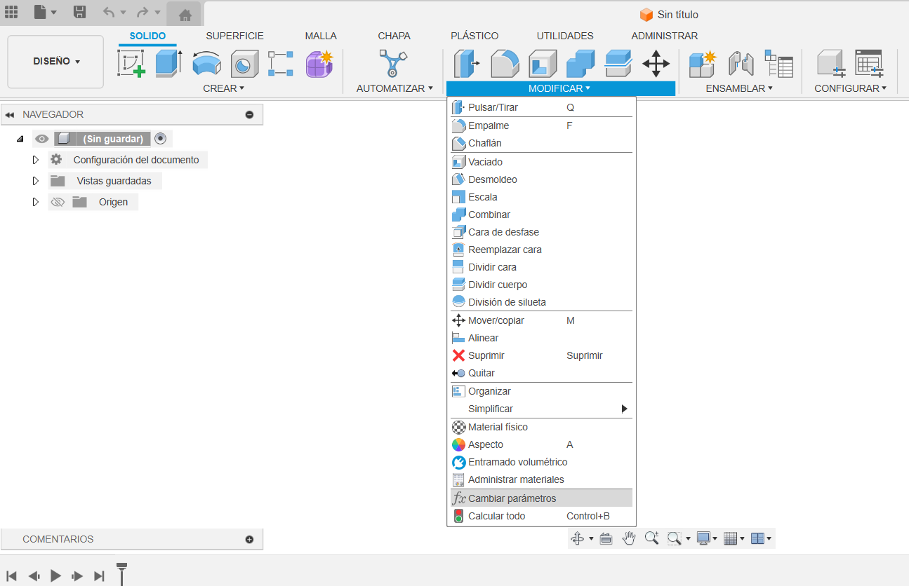

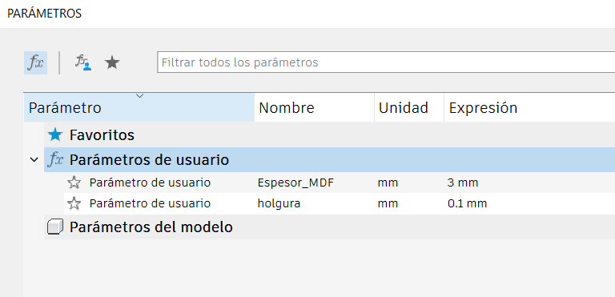

### Segundo Paso para el modelado 3D

Se diseño la base del diseño, en este caso un aerogenerador vertical, Teniendo en cuento las holgura y el espesor del MDF

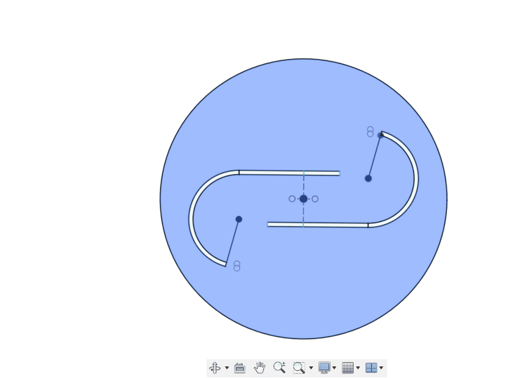

### Tercer Paso para el modelado 3D

Se realizó el mismo paso anterior per para las aspas.

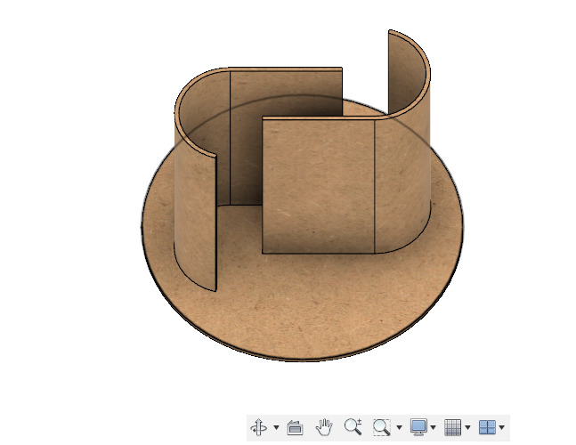

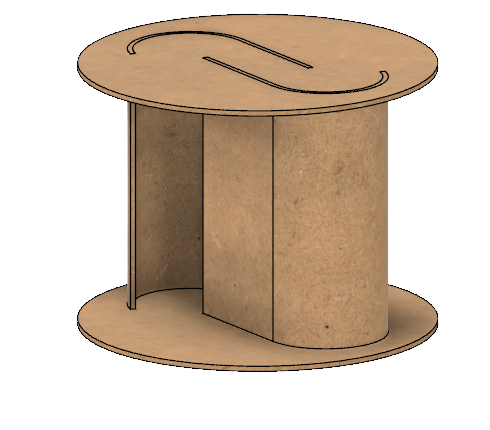

### Cuarto Paso para el modelado 3D

En el caso de las aspas, se realizó un patrón kerf bend para que tenga una tolerancia de doblado.

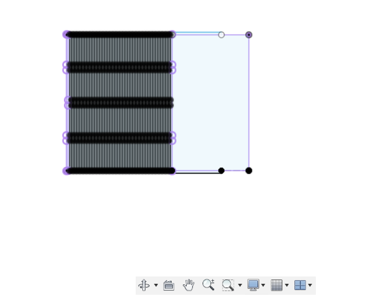

### INKSCAPE

Inkscape es un editor de gráficos vectoriales libre y de código abierto. Inkscape puede crear y editar diagramas, líneas, gráficos, logotipos, e ilustraciones complejas. El formato principal que utiliza el programa es Scalable Vector Graphics

La URL para acceder: https://inkscape.org/es/

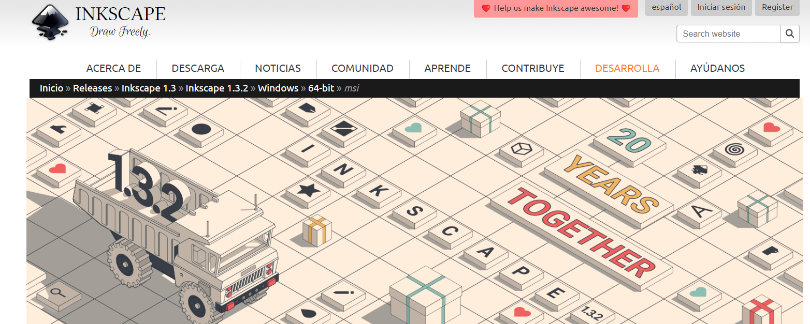

### Correción de vectores con INKSCAPE

Se realizó a la correción de vecotores y unión de nodos.

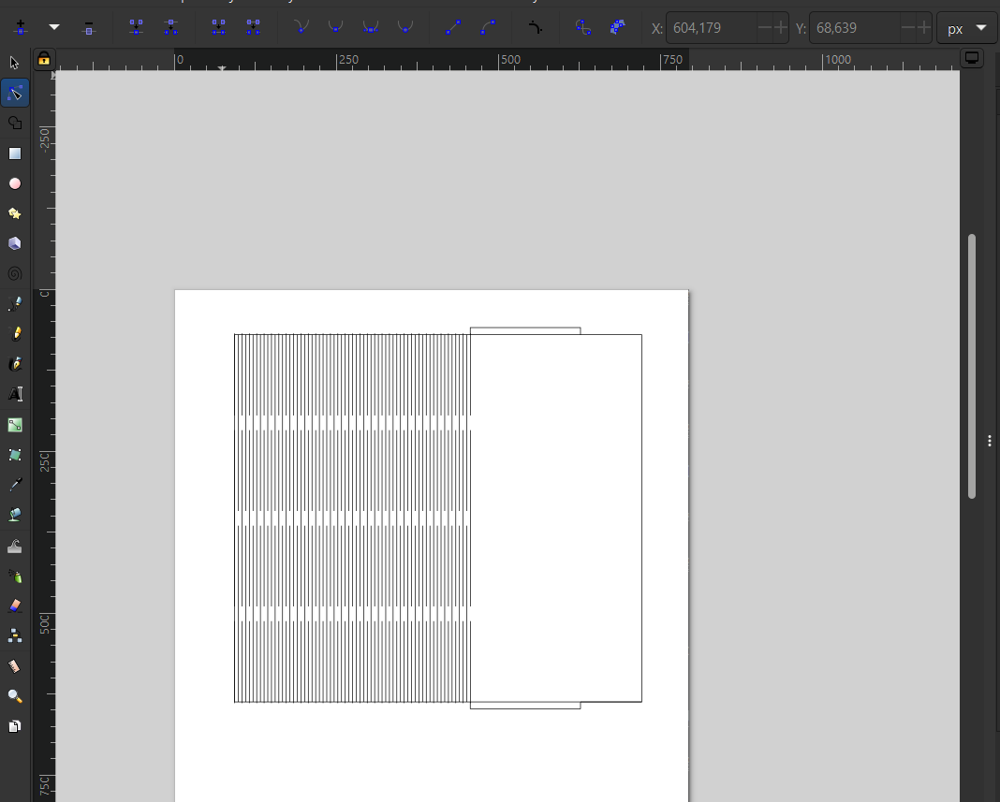

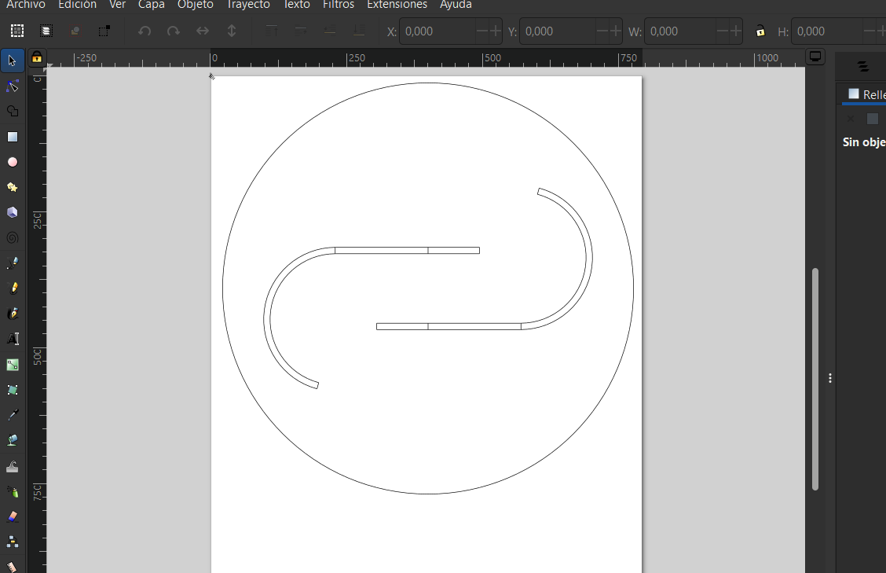

### RDWorks

RDWorks proporciona a los usuarios una herramienta conveniente para la clasificación manual de objetos gráfico

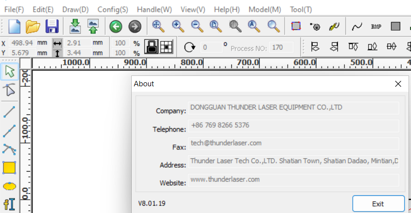

### Primer Paso RDWORKS

Se importo los diseño .dxf que se guardon en INKSCAPE ya corregidos. 

### Segundo Paso RDWORKS

Se seleccionaron los tipos de corte laser, en este caso ROJO para corte y AZUL para grbado lineal.

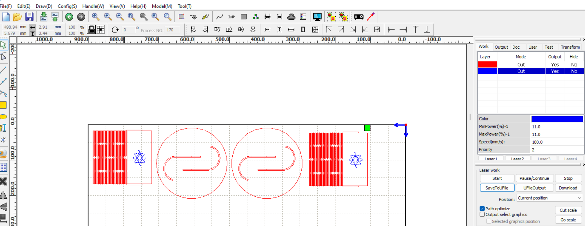

### Acceso a los archivo en drive

[Carpeta]([Logo](https://drive.google.com/file/d/1RLfONKZYy3gfTo7AExZfMajiqSh2bcb4/view?usp=sharing))

[Enlace para ver fabricación](https://le0nidas1.github.io/leonardo_eguia/fabricacion/fp01/)
