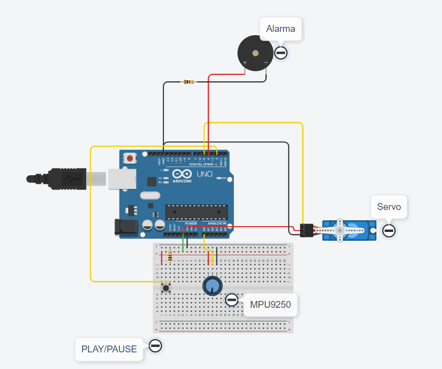

---
hide:
    - toc
---

# MT04

El módulo MT04 consiste en diseñar y documentar un proyecto utilizando Arduino en Tinkercad permitiendp familiarizarse con el uso de Arduino y Tinkercad Electronics, fomentando la comprensión de la integración de hardware y software. La documentación y publicación será en GitHub para ayudar a consolidar el conocimiento adquirido.

### Simulación Tinkercad
 
 Se utilizó Tinkercad para simular el proyecto. Aunque originalmente se empleó un giroscopio MPU9250, en la simulación se reemplazó por un potenciómetro debido a las limitaciones de componentes en Tinkercad. El uso del Arduino Uno junto con los sensores y actuadores seleccionados. Se uso un Pulsador conecatado al Pin 2. Este Actúa como trigger para pausar y continuar la operación del servomotor. Se usó este pulsador por lo Fácil de implementar y útil para interactuar manualmente. Se utilizo un servomotor en el Pin 5, controlado mediante PWM. Además un Buzzer que emite un sonido cuando el servomotor alcanza los límites de 0° y 180°. La razón de elección es proporcionar una retroalimentación audible inmediata sobre el estado del sistema.

La URL para acceder: https://www.tinkercad.com/things/5YguA8Y0ktw-efdi

### Conexionado Electrico

La siguiente sección está dedicada a mostrar el conexionado eléctrico del proyecto. A continuación, se proporciona un archivo PDF que ilustra detalladamente estas conexiones, el cual fue generado utilizando Tinkercad, una herramienta que ofrece esta funcionalidad de diagramación

[PDF](../pdf/tinkercad_mt04.pdf)

### Componentes usasdos

- 1 MPU9250
- 1 Pulsador
- 1 Resistencia de 1kΩ
- 1 Servomotor MG996
- 1 Buzzer de 5V
- 1 Arduino Uno
- 1 prtoboard

### Pruebas del proyecto

En el caso real, se utilizó el MPU9250 con comunicación I2C debido a su giroscopio. La elección de este módulo permite que los cambios en el ángulo de giro del giroscopio se reflejen en el servomotor. Se utilizó el eje x del giroscopio, que toma valores de -90 a 90, y mediante la función map() de Arduino, estos valores se transformaron en un rango de 0° a 180°.
Se llevó a cabo un vídeo para representar el funcionamiento del sistema o mostar el uso de los diferentes componentes. A continuiacíón se deja un video de ejemplo del funcionamiento.

[Video](https://drive.google.com/file/d/1zPyiLBMeP7J6njEv8l3-G8kgnNOfUiKh/view?usp=sharing)

### Código Arduino
A Continuación se deja el código arduino desarrollado

[Codigo Arduino]https://drive.google.com/file/d/1UmvZJXLlquA0CdddhOPalLqpoDZMFrOW/view?usp=sharing)

