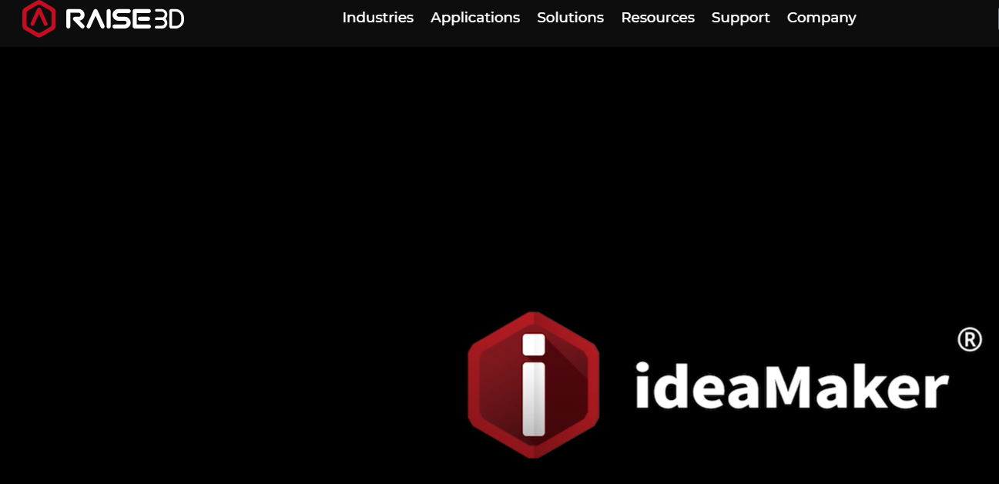
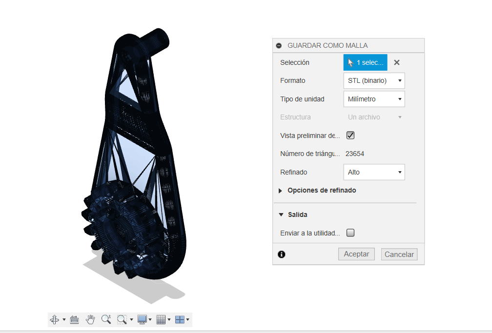

---
hide:
    - toc
---

# MT05

El módulo MT05 se centra en el proceso de generación de un archivo .gcode a partir de un modelo 3D para su impresión utilizando tecnología de modelado por deposición fundida (FDM). Esta actividad abarca desde la descarga de un archivo de diseño en Fusion 360, hasta la configuración de los parámetros de impresión en el software IDEAMAKER. El objetivo es preparar adecuadamente un modelo 3D para su fabricación, documentando cada paso del proceso y generando un archivo .gcode listo para la impresión. 

### Software 3D IDEAMAKER
 
IdeaMaker es una cortadora de modelos 3D para diseñar fácilmente archivos de impresión 3D. ideaMaker se conecta a la biblioteca ideaMaker para compartir y descargar diferentes modelos de impresión 3D.

La URL para acceder: https://www.raise3d.com/ideamaker/
enlace de descargas. https://www.raise3d.com/download/

### Descargar el archivo .f3d

Localizar y descargar el archivo ModeloMT05_EFDI.f3d desde la ubicación proporcionada en la plataforma EDU. Abrir y exportar en Fusion 360. Exportar el modelo como archivo .STL (binario).

### Importar en IDEAMAKER:

Importar el archivo .STL generado previamente en el software IDEAMAKER. Luego se siguió los siguientes pasos para tener en cuenta la impresión:

Posicionar la pieza:
Usar los comandos de MOVER y ROTAR para colocar la pieza en la posición más conveniente para la impresión FDM. Se la colocó la pieza acostada porque si se toma en cuenta que la fuerza aplicada es en el extremo, esta posición favorece en la posición de las capas de impresión.
Escalar la pieza:
Se escalo el modelo al 150% de su tamaño original, manteniendo las proporciones.
Generar soportes y base de construcción:
Añadir soportes de tipo triángulo y seleccionar una base de construcción del tipo BALSA.
Configurar parámetros de impresión:
Seleccionar una altura de capa de 0.2mm y 2 perímetros de pared para el modelo.
Configurar Densisdad de impresión:
Como es una pieza que se le va a realizar esfuerzos de palanca, se optó por un porcentaje de 50%. 
Elegir el extrusor (pico) IZQUIERDO para realizar el código. 

A continación se prentaran en las figuras las configuraciones más importantes.

### Generar el código G:

Realizar el corte del modelo.
Previsualizar y analizar la construcción del modelo en todas sus capas visualmente.
Exportar el archivo .gcode con el formato Leonardo_Eguia.gcode.

A Continuación se deja el archivo .gcode

[Codigo .gcode]https://drive.google.com/file/d/1isdNPrDAVVH1Spx-axMuFBUncByeAx5J/view?usp=sharing)

