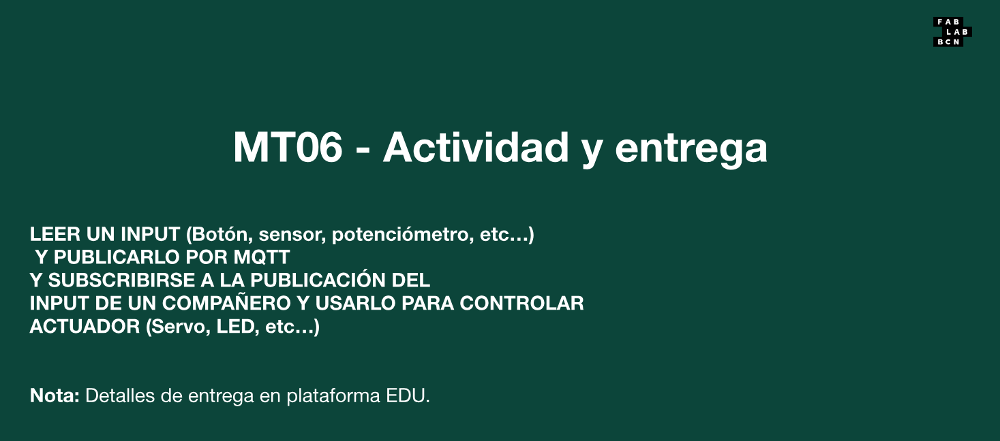
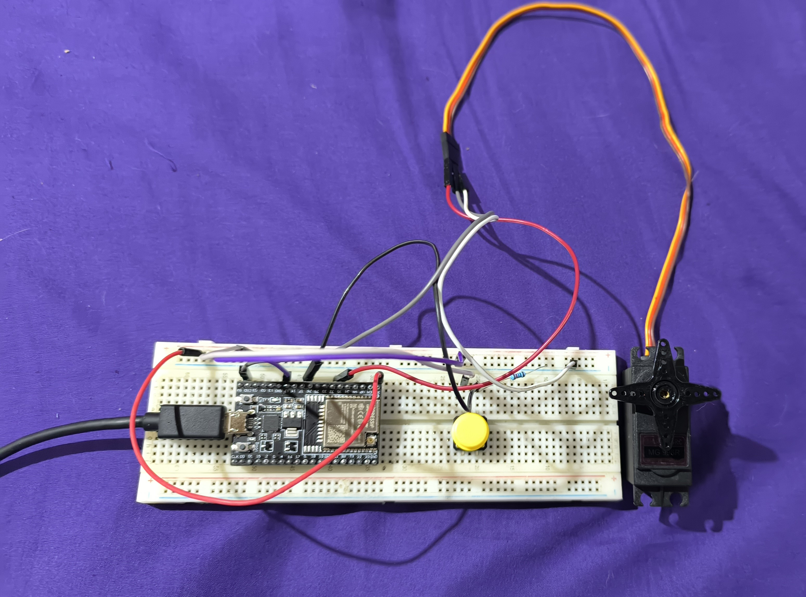
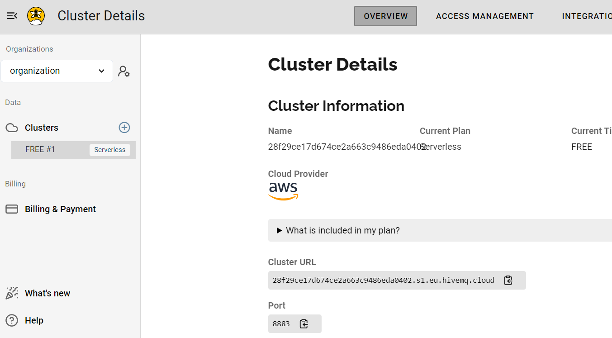
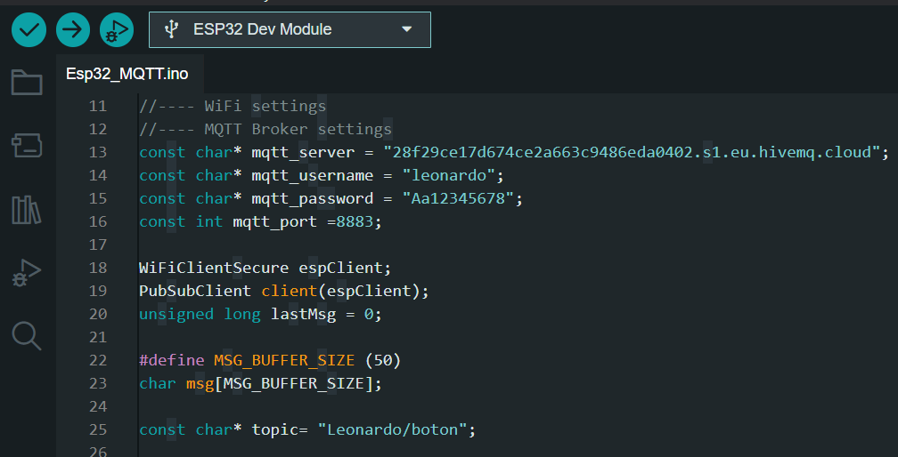

---
hide:
    - toc
---

# MT06

El módulo MT06 se centra en los fundamentos de la comunicación en microprocesadores, abordando conceptos clave como protocolos y tecnologías inalámbricas. A través de una serie de ejercicios prácticos y teóricos. Se hará uso de la comunicación en electrónica, destacando el uso de MQTT en proyectos de Arduino. El módulo culmina en la práctica de la comunicación entre dispositivos, preparándolos para futuras aplicaciones en proyectos innovadores.

### Actividad Planteada 

La actividad del módulo MT06 implica el uso de la placa ESP32 para leer un input, en mi caso un botón. Al presionar el botón, se publica un mensaje en un tópico mediante el protocolo MQTT. Posteriormente, al estar suscrito a ese tópico recibir el mensaje y utilizarlo para activar una salida, en este caso, controlar un servomotor. 

### Circuito Planteado 

Se pasa a describir el diseño y la implementación de un circuito utilizando la placa ESP32 WROOM 32U, que permite la lectura de un botón en el PIN 27 y el control de un servomotor con el PIN 32 a través de la publicación y suscripción a un tópico MQTT. Esta configuración es útil para aplicaciones de automatización y control remoto.

Componentes Utilizados:
- ESP32 WROOM 32U
- Botón
- Servomotor
- Resistencia (10kΩ)
- Cables de conexión
- Protoboard

### Uso plataforma HiveMQ

En este proyecto, se utilizó HiveMQ como el broker MQTT para facilitar la comunicación para la placa ESP32. HiveMQ es una plataforma robusta y confiable que permite la conexión y gestión de dispositivos IoT de manera eficiente.

Para configurar HiveMQ, se siguieron los siguientes pasos:

-Usuario: Se creó un usuario con el nombre "leonardo".
-Contraseña: Se estableció la contraseña "Aa12345678" para la autenticación del usuario.
-Puerto: Se utilizó el puerto 8883, que es el puerto estándar para conexiones MQTT seguras (TLS/SSL).
-URL del Cluster: La URL del cluster utilizado es: 28f29ce17d674ce2a663c9486eda0402.s1.eu.hivemq.cloud

Esta configuración permite que la ESP32 se conecte al broker y publique/reciba mensajes a través de los tópicos definidos, garantizando una comunicación efectiva y confiable.

### Codigo utilizado 

Para la implementación de la comunicación MQTT con la ESP32, se utilizó como base el ejemplo brindado por la web de HiveMQ en el siguiente enlace: https://community.hivemq.com/t/hivemq-using-esp32-and-nodered/1291

Modificaciones Realizadas
El ejemplo fue modificado para adaptarse a la configuración de nuestro propio broker en HiveMQ. Los cambios principales incluyen:
-Configuración url del Broker: 28f29ce17d674ce2a663c9486eda0402.s1.eu.hivemq.cloud
Se ajustaron las credenciales de autenticación:
-Usuario: leonardo
-Contraseña: Aa12345678
-Puerto: 8883
-Topic: Leonardo/boton

[Codigo Arduino](https://drive.google.com/drive/folders/1w4mRK7PButow9gb915-O-dhv2mQNIxax?usp=sharing)

### Resultado

Se logró establecer de manera exitosa la comunicación con el broker MQTT, permitiendo la interacción entre el botón, la ESP32 y el servomotor. A continuación, se detallan los aspectos más relevantes del funcionamiento del sistem
Publicación de Mensajes:
-Al presionar el botón conectado al PIN 27 de la ESP32, se publica un mensaje en el tópico Leonardo/boton con el contenido "Abrir" o "Cerrar". 
-Suscripción al Tópico:
La placa ESP32 se suscribe al mismo tópico (Leonardo/boton), lo que le permite recibir mensajes en tiempo real.
Cuando la ESP32 recibe el mensaje "Abrir", el servomotor se posiciona a 180°, lo que indica que se está activando la acción deseada.
En caso de recibir el mensaje "Cerrar", el servomotor se posiciona a 0°, completando así la funcionalidad de control.

### Video de Demostración
Para ilustrar el funcionamiento del sistema, se incluirá un video de la demostración. 

[VIdeo demostrativo](https://www.youtube.com/watch?v=2I2lBsl9nMw)
<iframe width="560" height="315" src="https://www.youtube.com/embed/2I2lBsl9nMw" frameborder="0" allowfullscreen></iframe>