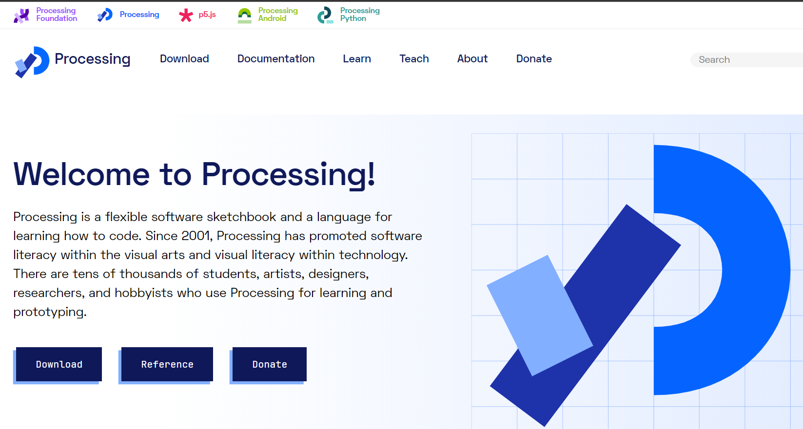
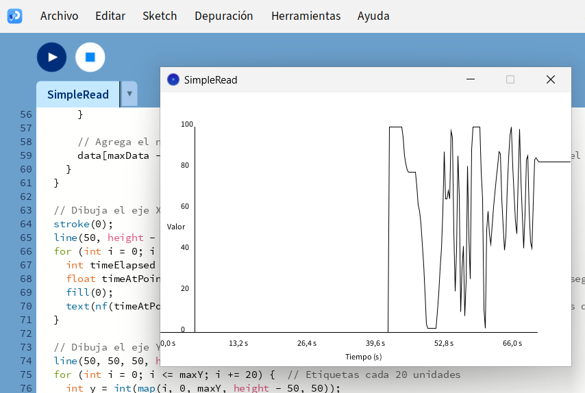
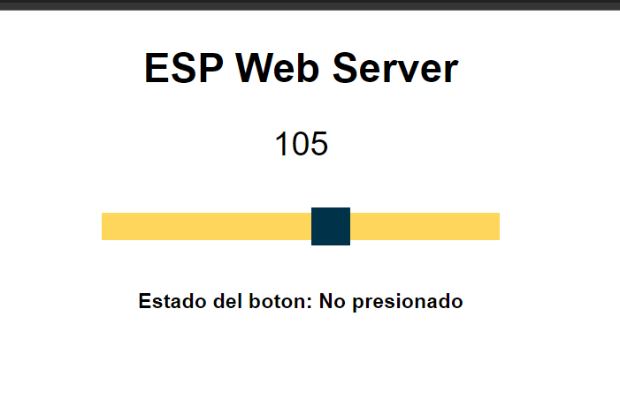
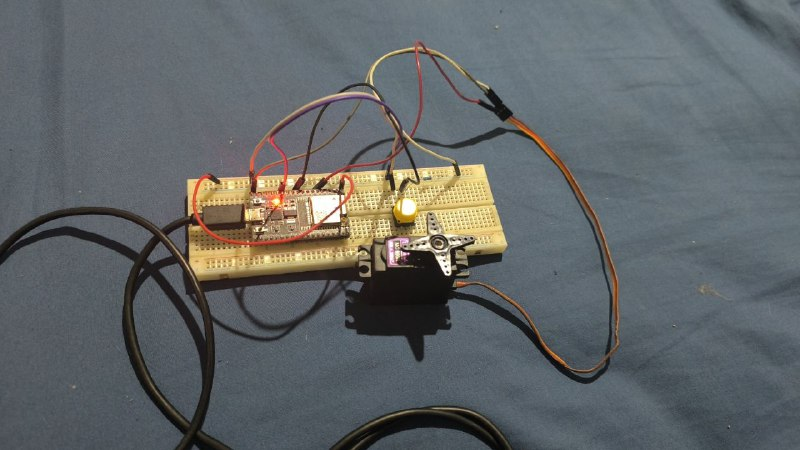

---
hide:
    - toc
---

# MT07

En el contexto del módulo MT07, este está centrada en interfaces digitales, abarcando conceptos fundamentales, lenguajes de programación y ejemplos prácticos de diseño y programación. Se exploraron herramientas como Processing, Arduino y Node-RED, y se demostró la configuración de microcontroladoras para diversas funciones.

### Processing

Processing es un entorno de programación y un lenguaje basado en Java, diseñado principalmente para la creación de arte visual y proyectos interactivos. Originalmente desarrollado para educar a artistas y diseñadores en la programación.

### Actividad usando Processing

Se utilizó Processing para leer datos enviados por el puerto serie desde una placa ESP8266. La ESP8266, se configuró para leer el valor analógico de un potenciómetro, que varía entre 0 y 100. Además de leer los datos, se creó una ventana gráfica en Processing. En esta ventana, se generó una gráfica que actualiza y muestra el valor recibido cada segundo. A medida que llegan nuevos datos, se representan gráficamente, permitiendo observar visualmente cómo varía el valor del potenciómetro en tiempo real.

[Codigo Arduino](https://drive.google.com/drive/folders/1SjxAECugxZY1lWpiKhL3uwkHFiyLkzzo?usp=sharing)

[Codigo Processing](https://drive.google.com/drive/folders/1kodPumI48Utc3S-zLUkHu9ltDcT3c8Wr?usp=sharing)

### ESP32 servidor web

Se creo un servidor web en el ESP32 que permite mover un servo motor desde un control deslizante en la página web. El valor del slider se envía al ESP32 y se usa para mover el servo.

Además se muestra el estado de un botón. Hay un botón físico conectado al pin 27 del ESP32. Se creó un elemento en la página web que muestra si el botón está "Presionado" o "No presionado". La ESP32 actualiza esta información cada 2 segundos.

La comunicación con el servidor web se comunica con el ESP32 usando peticiones de HTTP para cambiar el valor del servo o pedir el estado del botón.

Además se dejo el video mostrando evidencia.

[VIdeo demostrativo](https://www.youtube.com/watch?v=_YkmqT6Rw3s)
<iframe width="560" height="315" src="https://www.youtube.com/embed/_YkmqT6Rw3s" frameborder="0" allowfullscreen></iframe>

[Codigo Arduino](https://drive.google.com/drive/folders/1oGDKPr6QTtUJzjKEyIwruaBU-AbOtQ0A?usp=sharing)