---
hide:
    - toc
---

# MT08

El módulo MT08 se centra en la aplicación práctica de habilidades en la preparación y ejecución de operaciones de mecanizado CNC utilizando Fusion 360. Se aprenderá a configurar una fresadora, realizar operaciones de mecanizado como 2D cajeras, taladrado y contorneado, y generar G-code.

### Modelado 3D usando Autodesk Fusion 

Autodesk Fusion es una plataforma de software CAD, CAM, CAE y de circuitos impresos de modelado 3D basada en la nube para el diseño y la manufactura de productos.

La URL para acceder: https://latinoamerica.autodesk.com/products/fusion-360/

### Descargar el archivo .f3d

Localizar y descargar el archivo Entrega_MecanizadoMTO8.f3d desde la ubicación proporcionada en la plataforma EDU. Abrir e ir a la interfaz de FABRICACIÓN.

[Archivo .f3d](https://drive.google.com/file/d/1LtPr0RQdWEIW7CtqzE95KyDzig9P1hRA/view?usp=sharing)

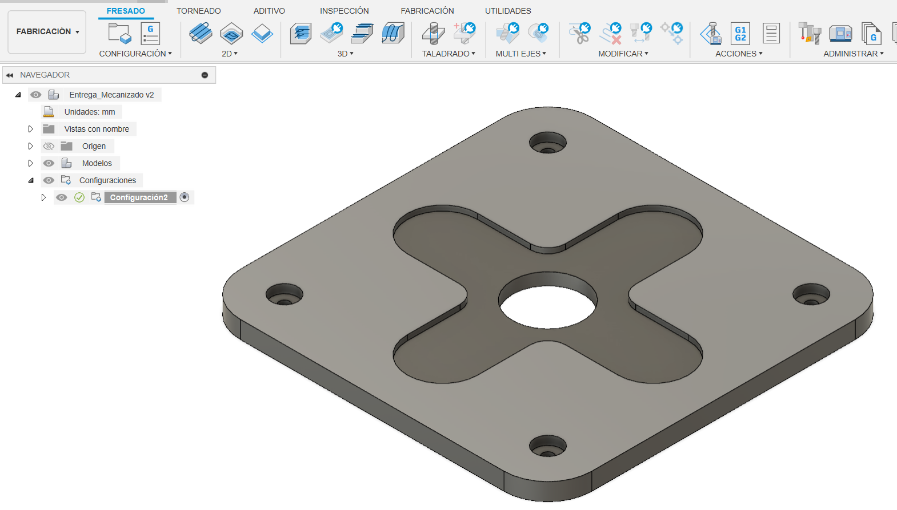

### Pieza a partir

Se parte diseñando la pieza de 200x200x10mm de madera multilaminada, la forma del modelo suministrado para ésta práctica.

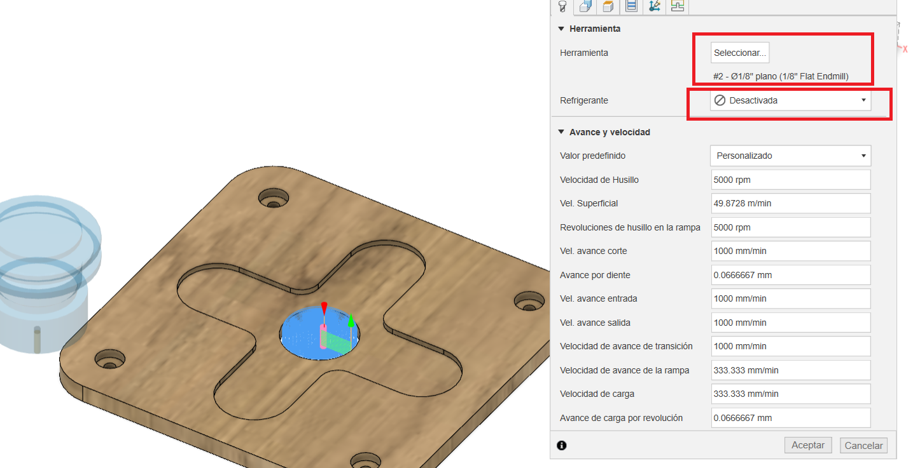

### Configuración de la Máquina

Configura la máquina de trabajo como una fresadora dentro del módulo de fabricación. En este caso elegir una fresadroa generica "Autodesk Generic 3-axis Router". Seleccionar la herramienta de fresado tipo plano de 1/8 de pulgada para esta operación.
Instalar post-procesador de Easel para Fusion 360 está diseñado para generar un código G que sea compatible con la máquina X-CARVE, la cual es operada por el software Easel. Para eso se debe descargar en el siguiente URL. 

[Archivo Easel](https://drive.google.com/file/d/1awccpPvpL28sB1gJozI6dwUnpSIph6Kb/view?usp=sharing)

Copiar este archivo a la carpeta donde se almacenan los post-procesadores de Fusion 360. Esta carpeta se crea automáticamente cuando instalas el software. Normalmente, la ruta es la siguiente: C:\Users\[NombreDeUsuario]\AppData\Local\Autodesk\Autodesk Fusion 360\CAM\cache\posts 

### Primera operación de Mecanizado Cajera

Seleccionar la operación 2D Cajeras dentro del módulo de fabricación, Seleeccionar Herramienta, eligir una herramienta de fresado tipo plano de 1/8 de pulgada para esta operación y desactivar el refrigerante.

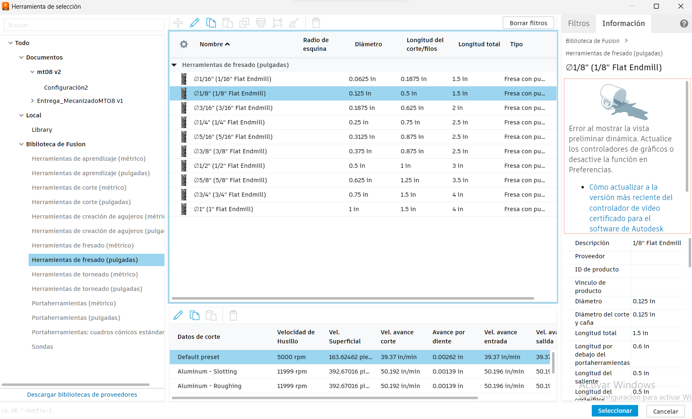

La herramienta debe estar orientada correctamente en el eje Z, seleccionando la cara superior y definir el punto de origen paea que quede lo más cerca posible al origen de la máquina. Luego se hace la selccion de cajera en el botón de cadena y seleccionar la arista. 
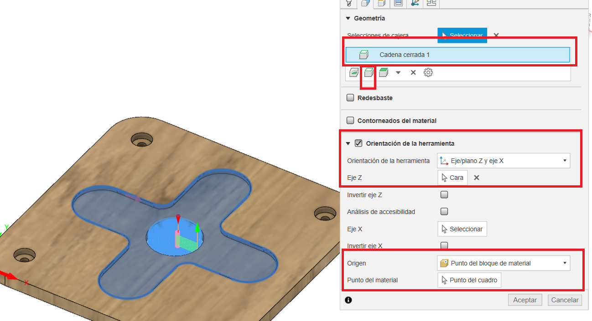

Elegir las diferentes alturas como mostrada en la imagen, en el caso de la altura inferior, se debe elegir la selección y seleccionar la cara intermedia donde va la cabeza del tornillo. 

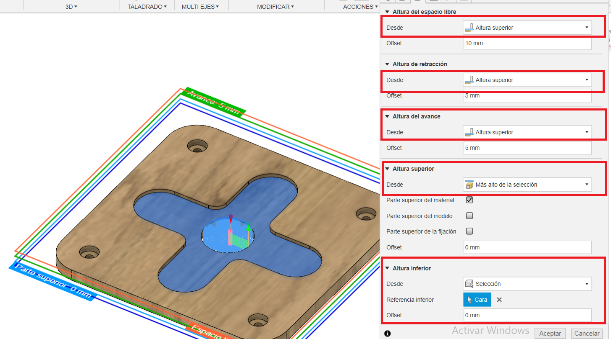

En la pestaña de pasadas, se debe selccionar compensación de lado a lado: "derecha". Seleccionar varias profundidades con reducción de debaste máximo de 1mm

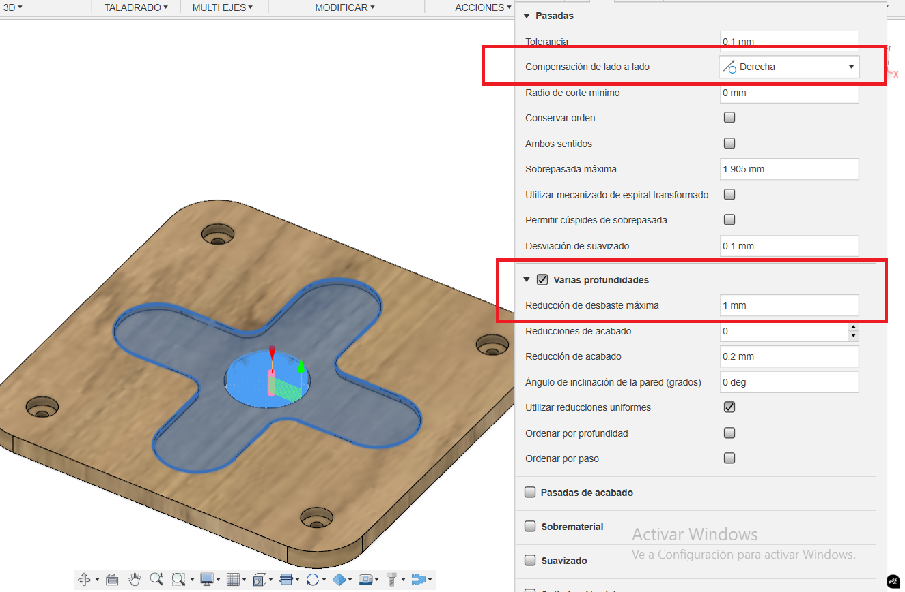

### Segunda operación de Mecanizado Cajera 

Esta operación es para quitar el material del centro de la cruz. Las configuraciones son iguales al paso anterior pero se debe selccionar la arista donde se encuentra el circulo central y además en las altura inferior se debe cambiar a más bajo de la selección.  

### Tercera operación de Mecanizado Cajera 

Esta operación es para quitar el material donde va la cabeza del tornillo. Las configuraciones son iguales al primer paso del mecanizado, pero se debe selccionar la arista donde se encuentra el circulo del tornillo.

### Cuarta operación de Mecanizado taladrado

Los pasos son muy similares a los pasos anteriores con las diferencias que se van a explicar. Se debe selccionar el agujero donde va a pasar el tornillo.

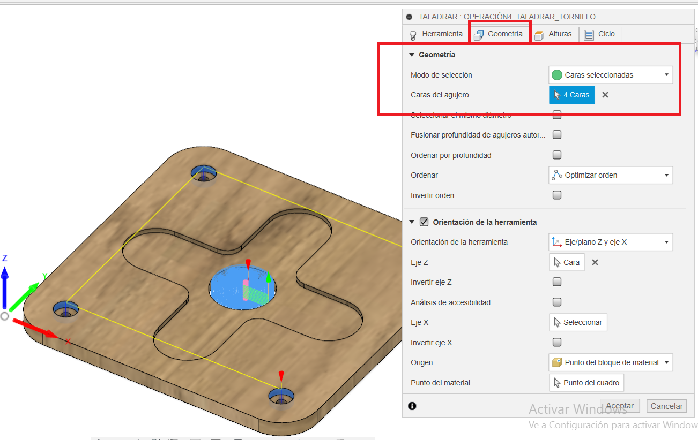

Las alturas superior debe se parte superior del agujero y la altura inferior debe ser parte inferior del agujero.

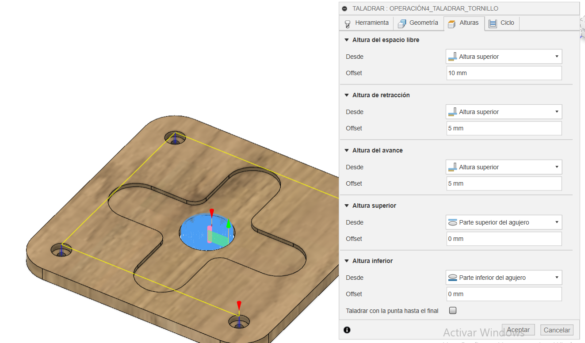

Luego en la pestaña de ciclo, se selcciona en tipo de ciclo, Taladrado profundo: retracción total

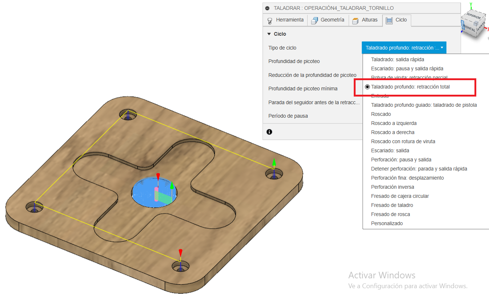

### Quinta operación de Mecanizado contorneado

Se repite los pasos anterior. Se debe seleccionar la cara lateral en geometría para hacer un contorneado de la pieza

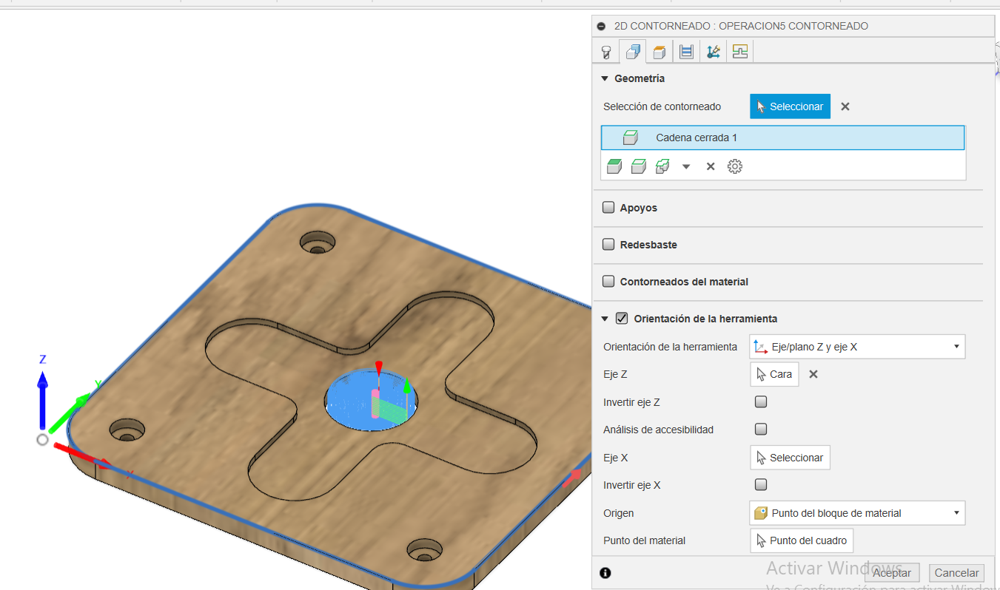

### Post Procesar

Para generar el archivo .nc, que contiene el código G que se utilizará para controlar la máquina CNC. 
Para asegurar de que el código G generado sea compatible con la máquina CNC X-CARVE controlada por el software Easel, es fundamental elegir el post-procesador adecuado. Seleccionar el post-procesador Easel y la máquina de Autodesk Generic 3-axis Router. 

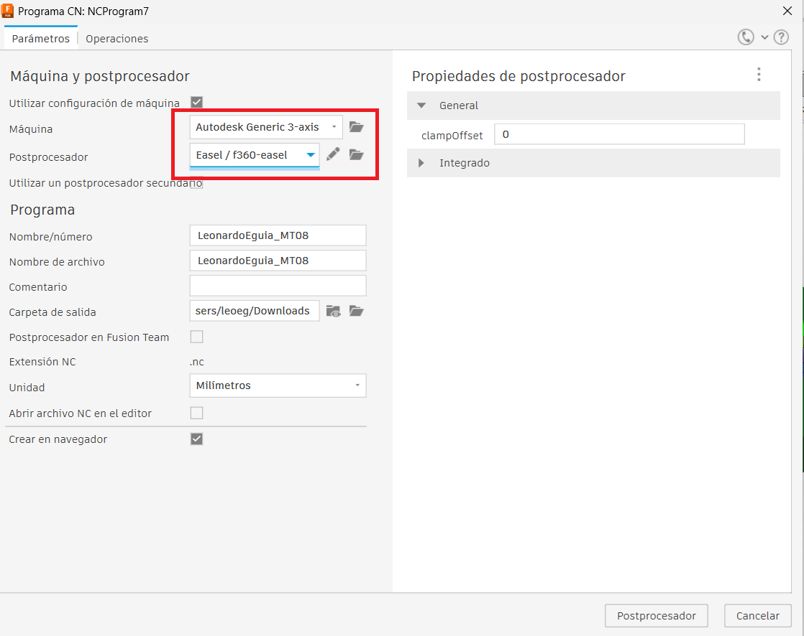

A Continuación se deja los archivos para descargar

[Codigo .gcode](https://drive.google.com/drive/folders/1LiBhaAZHaG_xEl88E2JbEmzCYhp3iFah?usp=sharing)

[Simulacion Mecanizado MT08](https://www.youtube.com/watch?v=IqJnHjdhV8w)
<iframe width="560" height="315" src="https://www.youtube.com/embed/IqJnHjdhV8w" frameborder="0" allowfullscreen></iframe>