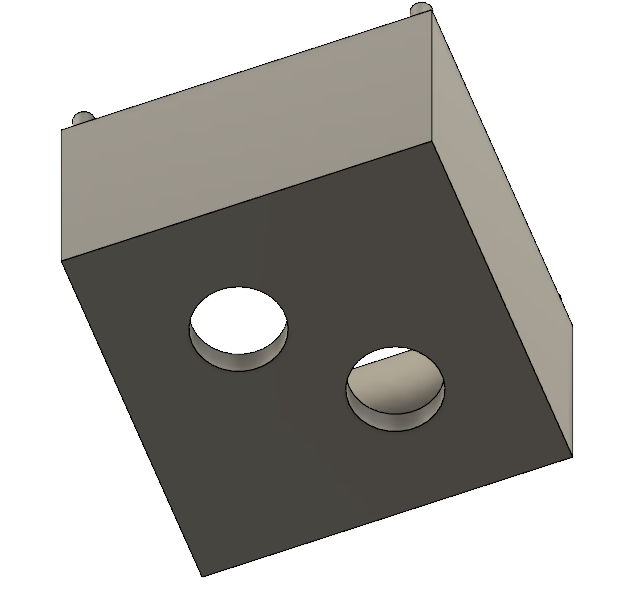

---
hide:
    - toc
---

# MT09

El módulo MT09 se enfoca en el diseño y fabricación de moldes, siguiendo un proceso técnico detallado. Se deberá diseñar una maceta y crear un molde en software CAD, utilizando Fusion 360.

### Modelado 3D usando Autodesk Fusion 

Autodesk Fusion es una plataforma de software CAD, CAM, CAE y de circuitos impresos de modelado 3D basada en la nube para el diseño y la manufactura de productos.

La URL para acceder: https://latinoamerica.autodesk.com/products/fusion-360/

### Diseño de la Maceta

Se paso a crear un modelo de maceta con un tamaño máximo de 10 cm de alto y 15 cm de diámetro. El diseño se realizó en Fusion 360, teniendo en cuenta las proporciones y requisitos establecidos.

### Diseño del Molde

Tras diseñar la maceta, el siguiente paso fue crear un molde en Fusion 360 que pueda contener el modelo de la maceta. Se utilizó una resta booleana entre el molde y el modelo de la maceta, lo que permite generar el espacio negativo dentro del molde que replicará la forma de la maceta al ser rellenado. Este molde tiene las siguientes características: 

Tiene 2 caras.
Tiene guías de encastre

### Diseño del Molde Segunda Versión

Tras las primeras pruebas con el molde utilizando yeso para su relleno, los resultados no fueron satisfactorios, lo que llevó a realizar ajustes en el diseño. Se decidió crear una nueva versión del molde en Fusion 360, en la que se hicieron dos modificaciones clave: Se modificó la ubicación del orificio por donde se introduce el material de relleno, mejorando así el flujo del material dentro del molde. El respiradero, que inicialmente estaba en la parte superior del molde, fue movido a la base, permitiendo que el aire salga con mayor facilidad

### Archivos descargables

A Continuación se deja los archivos para descargar

[Archivo F3D](https://drive.google.com/drive/folders/1ib2ajf_Oh1cTbQ6Vc9KOY-QcjMgiFId8?usp=sharing)

